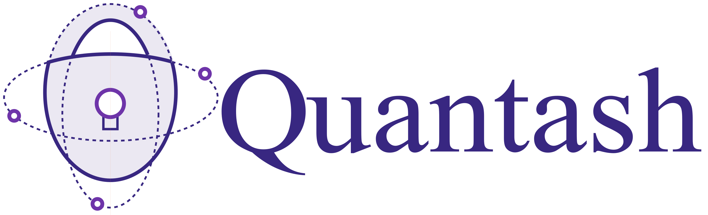

# Quantash

Quantash (Quantum Agile Security Hardware) is an open-source, hardware-optimized Post-Quantum Cryptography (PQC) Security Element IP core designed for seamless integration into ASIC and FPGA platforms.
The project combines a compact open-source RISC-V processor with custom hardware accelerators to efficiently offload and execute the computationally intensive operations of modern PQC algorithms on resource-constrained embedded devices.
See [Quantash Documentation](https://9bit-embedded.github.io/Quantash/) for more information.

## Features

- Lightweight RISC-V processor core
- Hardware accelerators for PQC operations
- FPGA/ASIC-ready IP design
- Low-power architecture for IoT devices
- Modular design supporting multiple PQC algorithms

## Use Cases

Quantash is designed for embedded and resource-constrained systems that require post-quantum security. Key applications include:

- **IoT Devices**
  - Offload ML-KEM and other PQC operations to hardware accelerators.
  - Reduce CPU load and power consumption for secure device-to-cloud communication.

- **Hardware Security Modules (HSMs)**
  - Modular PQC co-processor for SoCs or standalone HSMs.
  - Isolated execution of cryptographic operations and key management.

- **Low-power wireless connectivity chips**
  - Accelerate key encapsulation/decapsulation in lightweight wireless protocols.
  - Minimize latency for time-critical security tasks.

- **Trusted Execution Environments (TEEs)**
  - Dedicated hardware for cryptography without impacting the main processor.
  - Maintain isolation of secret keys and cryptographic state.

## Project Status

Quantash is currently in active development.
Early documentation and initial hardware blocks will be published as they mature.

Stay tuned for updates!

## Contributing

We highly appreciate contributions from the community. To ease work of reviewing your contributions, please:

 - Create your own branch to commit your changes and then open a Pull Request.
 - Split large contributions into smaller commits addressing individual changes or bug fixes.  
 - Write meaningful commit messages. 
 - If asked to modify your changes, do fixup your commits and rebase your branch to maintain a clean history.

## About this repository

This repository contains hardware, software and utilities written as part of the Quantash project.
It is structured as monolithic repository, or "monorepo", where all components live in one repository.

## Licensing

Unless otherwise noted, everything in this repository is covered by the Apache License, Version 2.0 (see [License](https://github.com/9bit-embedded/Quantash/blob/main/LICENSE) for full text).

---

Quantash is developed and maintained by [9bit Embedded](https://9bitembedded.com/) Team.
